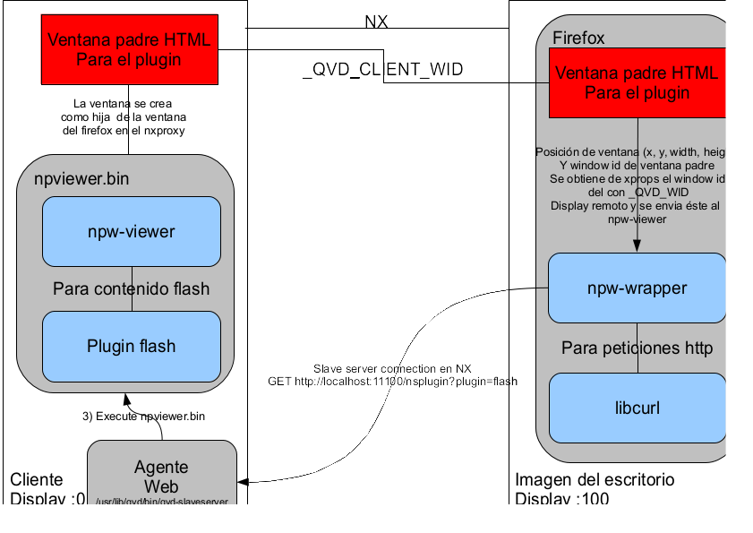
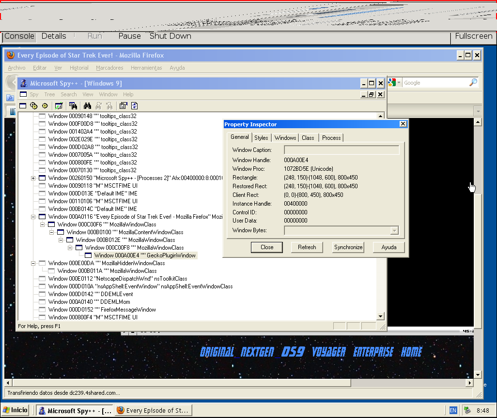
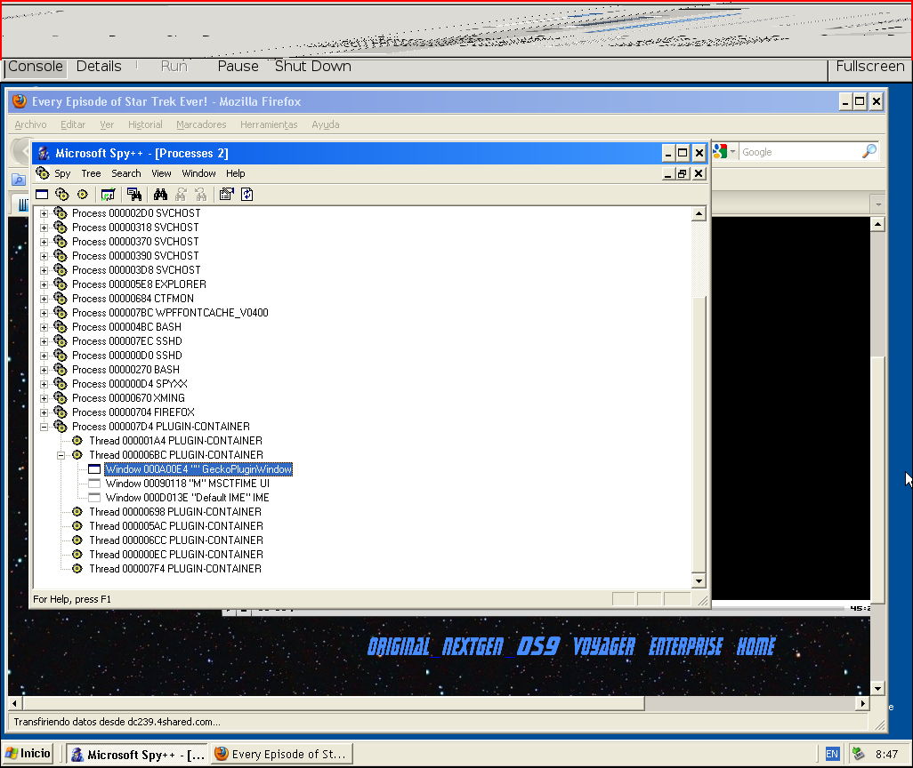

Flash Redirection
=================

Architecture
============

Objective
---------

The objective is to be able to view the flash plugin in the local desktop
for the QVD client using a streaming channel.

Documentation and repositories
------------------------------

 * nspluginwrapper repository in https://github.com/theqvd/nspluginwrapper
 * Adobe flash player
 * X2GO gathering presentation. See the doc/QVD_presentation_x2go_gathering_flash_20150621.pdf
 * Nxagent window id and event redirection patch. See https://github.com/theqvd/qvd-nx/tree/flash_plugin
 * QVD client slaveserver with nsplugin support. See ext/QVD-Client in https://github.com/theqvd/theqvd

Components
----------

 * The remote desktop. This one contains:

   * Browser. We use firefox
   * The original plugin. We have been using flash, adobe-flashplugin in Ubuntu : librery /usr/lib/adobe-flashplugin/libflashplayer.so) [This is needed to register the plugin but it is not used besides the registration with npconfig]
   * nspluginwrapper. We use https://github.com/theqvd/nspluginwrapper
 * The local desktop
   * The original plugin. We have been using flash, adobe-flashplugin in Ubuntu : librery /usr/lib/adobe-flashplugin/libflashplayer.so)
   * nspluginwrapper. We use https://github.com/theqvd/nspluginwrapper
    $HOME/.mozilla/plugins/npwrapper.libflashplayer.so. The client side is known as npw-viewer.
   * The web server. It is responsible of:
       * Start npwviewer
       * Start plugin
       * Stop plugin
 * Communication channels.
   * HTTP to invoke the plugin
   * This HTTP connection is then upgraded for socket communication (npw-wrapper in the QVD desktop and npw-viewer in the local desktop)

 

Note:

 * The white squares represent displays
 * The grey squares represent processes
 * The blue mean libraries or modules inside the process
 * The red squares represent windows

Installation
============

In the remote desktop
---------------------

 * Install the patched agent from https://github.com/theqvd/qvd-nx/tree/flash_plugin

 * Install the flash plugin:
```
echo 'deb http://archive.canonical.com/ubuntu trusty partner' |sudo tee -a /etc/apt/sources.list
sudo apt-get update
sudo apt-get install adobe-flashplugin
```
 * Compile nspluginwrapper. '''Note:''' By default it always compiles for 32 bit to compile for 64bits it is necessary to run configure as "./configure --target-cpu=x86_64"
```
sudo apt-get install libglib2.0-dev libgtk2.0-dev libcurl4-openssl-dev libxt-dev
git clone https://github.com/theqvd/nspluginwrapper.git
cd nspluginwrapper
make clean && ./configure --target-cpu=x86_64 && make && sudo make install
```
 * Create wrapper for /usr/lib/adobe-flashplugin/libflashplayer.so
```
./npconfig -r /home/nito/.mozilla/plugins/npwrapper.libflashplayer.so 2>/dev/null
./npconfig -i /usr/lib/adobe-flashplugin/libflashplayer.so
sudo rm /usr/lib/mozilla/plugins/flashplugin-alternative.so
```
 * Verify that the plugin is activated with npconfig and firefox
```
$ ./npconfig -l
/home/nito/.mozilla/plugins/npwrapper.libflashplayer.so
  Original plugin: /usr/lib/adobe-flashplugin/libflashplayer.so
  Plugin viewer: /usr/lib/nspluginwrapper/i386/linux/npviewer
  Wrapper version string: 1.4.4.1-1
$
```
 * Execute firefox with about:plugins and verify that the plugin is activated

 

 * Activate the slave channel for vma. Add the following to /etc/qvd/vma.conf. The redirection is done at port 11100 in the container, and invokes client.slave.command defined in client.conf of the QVD client.
```
vma.slave.enable=1
```

In the local desktop
--------------------


 * Install the flash plugin:
```
sudo apt-get install adobe-flashplugin
```
 * Compile nspluginwrapper. '''Note:''' By default it always compiles for 32bits, to compile for 64bits it is necessary to launch  configure as "./configure --target-cpu=x86_64"
```
git clone https://github.com/theqvd/nspluginwrapper.git
cd nspluginwrapper
make clean && ./configure --target-cpu=x86_64 && make && sudo make install
```
 * Create the wrapper for /usr/lib/adobe-flashplugin/libflashplayer.so
```
./npconfig -r /home/nito/.mozilla/plugins/npwrapper.libflashplayer.so 2>/dev/null
./npconfig -i /usr/lib/adobe-flashplugin/libflashplayer.so
sudo rm /usr/lib/mozilla/plugins/flashplugin-alternative.so
```
 * Verify that the plugin is activated with npconfig ahd with firefox
```
$ ./npconfig -l
/home/nito/.mozilla/plugins/npwrapper.libflashplayer.so
  Original plugin: /usr/lib/adobe-flashplugin/libflashplayer.so
  Plugin viewer: /usr/lib/nspluginwrapper/i386/linux/npviewer
  Wrapper version string: 1.4.4.1-1
$
```

 * Install the latest QVD-Client (version >= 0.2) and QVD-HTTPD package from github.

```
git clone https://github.com/theqvd/theqvd.git
cd theqvd/ext/QVD-Client
/usr/lib/qvd/bin/perl Build.PL  && ./Build && sudo ./Build install
cd ../QVD-HTTPD
/usr/lib/qvd/bin/perl Makefile.PL && make && sudo make install
```

 * In the $HOME/.qvd/client.conf include the line.
```
client.slave.command=/usr/lib/qvd/bin/qvd-client-slaveserver
```


Invocation secuence
===================

To test the invocation follow these steps:

 * Launch firefox in the remote Desktop. You can launch them with the following environment variables

```
export NPW_INIT_TIMEOUT=300
export NPW_MESSAGE_TIMEOUT=300
export NPW_DEBUG=1
export NPW_LOG=/tmp/npw-wrapper.out
firefox http://www.youtube.com/watch?v=Cp_ut3TrzxU
```

 * The following happens:
   * In the remote desktop the firefox detects the flash content e invokes the plugin associated plugin (nspluginwrapper).
   * The nspluginwrapper executes executes in the local desktop the following command to get the information for the plugin
```
/usr/lib/nspluginwrapper/i386/linux/npviewer --info --plugin /usr/lib/adobe-flashplugin/libflashplayer.so
PLUGIN_NAME 15
Shockwave Flash
PLUGIN_DESC 25
Shockwave Flash 11.2 r202
PLUGIN_MIME 98
application/x-shockwave-flash:swf:Shockwave Flash;application/futuresplash:spl:FutureSplash Player
```

 * In the remote desktop. The nspluginwrapper connects to localhost 11100 and invokes the following remote method, the same channel is used afterwards as socket communicationx:
```
GET /nsplugin?plugin=flash HTTP/1.1
Connection: Upgrade
Upgrade: qvd:slave/1.0

HTTP/1.1 101 Switching Protocols

```
 * In the local desktop. The process /usr/lib/qvd/bin/qvd-client-slaveserver (See TODO fix url https://github.com/theqvd/theqvd) detects the path /nsplugin and invokes npw-viewer:

 * In the local desktop. The web agent invokes npw-viewer. This knows that it is a remote invokation because of the remote-invocation flag --remote-invocation, the remote rpc port use is now deprecated (arguments --conection=127.0.0.1:2111) and is no longer used.
```
/usr/lib/nspluginwrapper/x86_64/linux/npviewer --plugin /usr/lib/adobe-flashplugin/libflashplayer.so --connection 127.0.0.1:2111 --remote-invocation id=libflashplayer.so-9509
```
 * In the remote desktop. The npw-wrapper obtains from firefox the windowid where the window should be placed (this is part from the mozilla plugins NPAPI API). From this windowid it tries to obtain the X11 Window property (xprop) _QVD_CLIENT_WID that maps the windowid in the remote desktop to the windowid in the local desktop (this can be reproduced with the command "xprop" selecting the window in the remote desktop)

 * In the remote desktop->local desktop. npw-wrapper indicates that the window needs to be created with the windowid specified by the _QVD_CLIENT_WID property (this is the local window)
 * In the remote desktop->local desktop. npw-wrapper passes all the API requests from firefox through the TCP socket, and npw-viewer access the remote URLs also through the same socket.

References
==========

* https://developer.mozilla.org/en/plugins api del firefox

* http://web.archive.org/web/20080507163354/gwenole.beauchesne.info/en/projects/nspluginwrapper nspluginwrapper

* http://library.gnome.org/devel/gdk/stable/gdk-Windows.html gdk_window_reparents


Environment variables for nspluginwrapper
=========================================

 * QVD_NSPLUGIN_DISABLE: If defined npw-wrapper will not try to use the NX channel via http://localhost:11100, insted it uses the traditional nspluginwrapper of using the unix socket. Example: "export QVD_NSPLUGIN_DISABLE=1" and to deactivate "unset QVD_NSPLUGIN_DISABLE"
 * QVD_REMOTE_INVOCATION_URL: This is to change the invocation URL. This is useful to use a different communication method instead of NX, for example SSH tunneling or direct communication. Example "export QVD_REMOTE_INVOCATION_URL=http://10.0.0.1:11200/nsplugin". To deactivate it  "unset QVD_REMOTE_INVOCATION_URL". Example to use it with socat.
```
socat TCP4-LISTEN:11200,fork,reuseaddr,nodelay EXEC:/usr/lib/qvd/bin/qvd-client-slaveserver
```
 * NPW_INIT_TIMEOUT. Connection timeout fot the TCP redirection. Normally not necessary, it used in the npw-wrapper.
 * NPW_MESSAGE_TIMEOUT. RPC response timeout for the nspluginwrapper protocol.
 * NPW_DEBUG. Set the 1 to activate the debug, this can be used in the local and remote desktop. See also NPW_LOG.
 * NPW_LOG. File where the log information is sent, if not defined it will use stderr
 * QVD_REMOTE_INVOCATION_TIMEOUT: Timeout in seconds for the first curl connection in the npw-wrapper


How to use it with SSH tunneling
================================

In the local desktop

```
PORT=11200
REMUSER=nito
CONTAINERIP=10.3.15.254
qvd-client &
ssh -N -R $PORT:localhost:$PORT $REMUSER@$CONTAINERIP &
socat TCP4-LISTEN:$PORT,fork,reuseaddr,nodelay EXEC:/usr/lib/qvd/bin/qvd-client-slaveserver
```

In the remote desktop

```
PORT=11200
export QVD_REMOTE_INVOCATION_URL=http://10.3.15.1:$PORT/nsplugin
export QVD_REMOTE_INVOCATION_URL=http://localhost:$PORT/nsplugin
firefox https://www.youtube.com/watch?v=4lM5nOveeA0
```

TODO
====

 * There seems to be some blocking in the remote invocation calls. This makes the videos stop, further investigation is needed here.
 * Test windows client
 * Warnings between GdkWindows to GTKWindows
```
(npviewer.bin:9533): GLib-GObject-WARNING **: invalid cast from `GdkWindow' to `GtkObject
(npviewer.bin:9533): GLib-GObject-WARNING **: invalid cast from `GdkWindow' to `GtkObject'

(npviewer.bin:9533): GLib-GObject-WARNING **: invalid cast from `GdkWindow' to `GtkWidget'

(npviewer.bin:9533): GLib-GObject-WARNING **: invalid cast from `GdkWindow' to `GtkObject'

(npviewer.bin:9533): GLib-GObject-WARNING **: invalid cast from `GdkWindow' to `GtkObject'

```

Window Plugin usage
===================
Or the chicken and egg problem

Options:

 * Use libflashplugin.so (the original acrobat plugin for linux). Problem the format is ELF and cygwin and similars use the COFF formand. The problem is how to invoke libflashpliugin from an windows environment. Advantages it uses gtk, X11 and similar technology

 * Use NPSWF32.dll (The original acrobat for windows). Problem it uses hWND (handle windows from USER32.DLL). This doesn't integrate natively and transparently with the X11 server (nxproxy, Xming, ...) Xming at least does not map the Xwindow id to window HWND...
   One option could be to create a GTK window in multiwindow mode or something similar, some coding into the X server would probably needed.

 * Use gnash, or a similar one, the problem is that some of the sites do not work.

 

 


One option is to try to change Xming (or whatever X server used) and allow to create X11 window that have as backend a HWND (that is a "window" in Windows world)

Some coding info
================

The first change made was to change the unix socket by a TCP socket. For that the following has been defined.

 * npw-qvd-connection.[ch]: Basic functions that save or not if you can use TCP sockets of ir you use a remote agent. If it
does not use a remote agent then fork/exec mechanism if used. If remote invocation is detected then npw-viewer is invoked via an http methd. This part is common between client and server.
   It also makes invocation http via CURL, and parses the output in format key=value. This is only executed on the client to avoid dependencies to libcurl. Here client means npw-wrapper or remote desktop.
      * translate_parent_window_id. Returns the mapping of the windowid in the nxagent, that is it retuns the property _QVD_CLIENT_WID

 * npw-wrapper.c. The function NPP_SetWindow is modified (method that is used to create and modify the windows in the plugin. Look for the functions: qvd_use_remote_plugin
 * rpc.c. The socket establishment sockets are modified. Look forqvd_use_remote_plugin

== xprop ==

Some xprop examples

To set the property, execute in the remote display (0x200006 is the container window and 0x5e00027 is the window where the events will be sent):
```
xprop -id 0x200006 -f _QVD_REDIRECT_EVENT 32x -set ATOM 0x5e00027
xprop -id 0x200003 -f _QVD_REDIRECT_EVENT 32x -remove _QVD_REDIRECT_EVENT
```

Copyright
=========
Copyright 2009-2010 by Qindel Formacion y Servicios S.L. for the QVD project
http://theqvd.com

This program is free software; you can redistribute it and/or modify it
under the terms of the GNU GPL version 3 as published by the Free
Software Foundation.

See also the original license in the README file